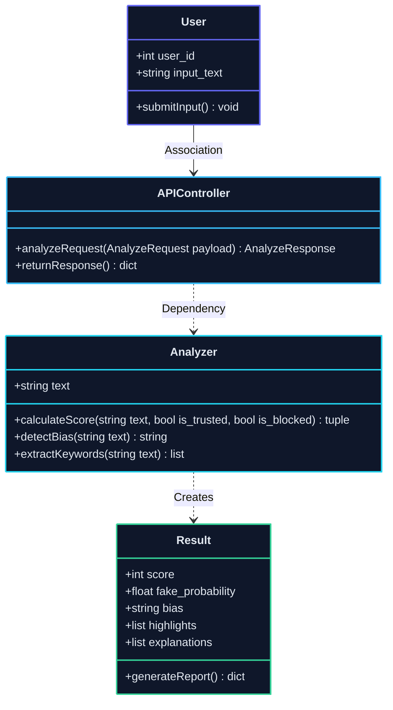
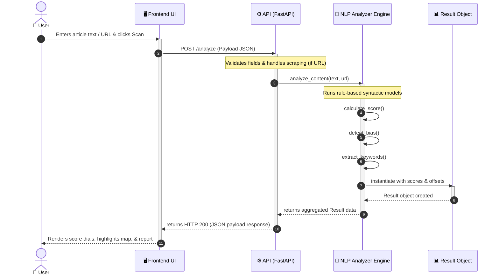
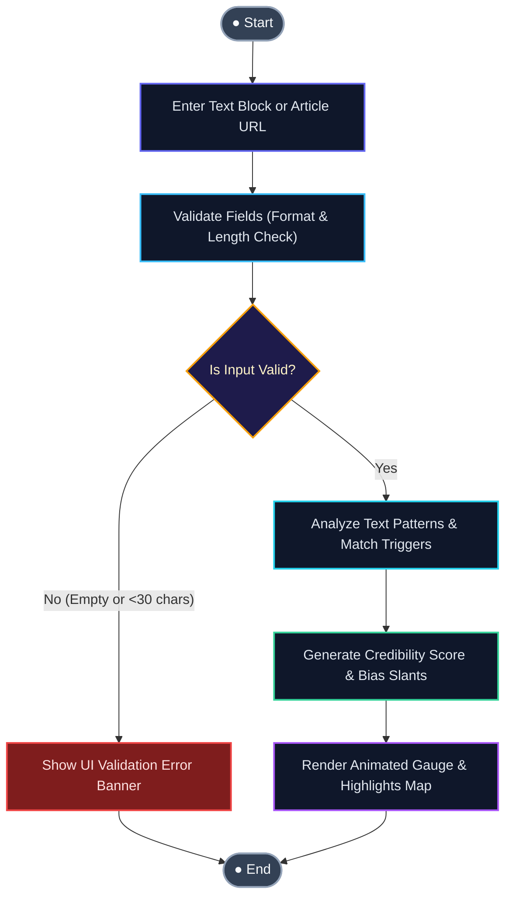

# RealityCheck AI – UML Diagram Package

This document contains professional, standard UML diagrams for the **RealityCheck AI – Fake News & Misinformation Analyzer** web application. The diagrams map to clean software engineering notations, showcasing structural models, behavioral workflows, and modular deployment topologies.

---

## 1. Use Case Diagram

The Use Case Diagram displays structural boundaries and interactions between the actor (`User`) and the functional capabilities of the system.

```mermaid
graph LR
    %% Definition of Actor
    subgraph SystemBoundary [" RealityCheck AI Application Boundary "]
        uc1(["Enter Headline, Text, or URL"])
        uc2(["Analyze Content"])
        uc3(["View Credibility Score (0-100)"])
        uc4(["View Bias & Slant Spectrum"])
        uc5(["View Highlighted Suspicious Words"])
        uc6(["View Verification Report Explanations"])
    end

    ActorUser["👤 User"]

    %% Connect User to all Use Cases with straight UML association lines
    ActorUser --- uc1
    ActorUser --- uc2
    ActorUser --- uc3
    ActorUser --- uc4
    ActorUser --- uc5
    ActorUser --- uc6

    %% Styling & Aesthetics
    style ActorUser fill:#1e1b4b,stroke:#818cf8,stroke-width:2px,color:#e0e7ff
    style SystemBoundary fill:rgba(15,23,42,0.4),stroke:#334155,stroke-width:2px,color:#94a3b8
    
    style uc1 fill:#0f172a,stroke:#38bdf8,stroke-width:2px,color:#f8fafc
    style uc2 fill:#0f172a,stroke:#6366f1,stroke-width:2px,color:#f8fafc
    style uc3 fill:#0f172a,stroke:#34d399,stroke-width:2px,color:#f8fafc
    style uc4 fill:#0f172a,stroke:#fbbf24,stroke-width:2px,color:#f8fafc
    style uc5 fill:#0f172a,stroke:#fb7185,stroke-width:2px,color:#f8fafc
    style uc6 fill:#0f172a,stroke:#22d3ee,stroke-width:2px,color:#f8fafc
```

---

## 2. Class Diagram

The Class Diagram presents the static object-oriented architecture of the platform, including attributes, methods, types, and standard UML structural relationships (Associations, Dependencies, and Creations).



---

## 3. Sequence Diagram

The Sequence Diagram details the time-ordered interactive messaging flow between subsystems when a user triggers content verification.



---

## 4. Activity Diagram

The Activity Diagram highlights the behavioral execution flow and logical decision routing branches within the verification workflow.



---

## 5. Component Diagram

The Component Diagram displays the high-level physical modular building blocks of the platform, showing interfaces and wiring connections.

```mermaid
graph LR
    subgraph ClientSpace [" Client Environment "]
        ComponentUI["🖥️ Frontend UI Component <br> (index.html, styles.css, app.js)"]
    end

    subgraph ServerSpace [" Server Environment (FastAPI App) "]
        ComponentAPI["⚙️ API Controller Component <br> (routes/analyze.py)"]
        ComponentNLP["🧠 NLP Analyzer Component <br> (utils/nlp.py)"]
        ComponentScrape["🕷️ Scraper Service Component <br> (services/scraper.py)"]
        ComponentDB[("🗃️ Reputation Database <br> (whitelists/blacklists)")]
    end

    %% Wiring Connections
    ComponentUI -->|"REST API (HTTP POST /analyze)"| ComponentAPI
    ComponentAPI -->|"Calls logic"| ComponentNLP
    ComponentAPI -->|"Invokes crawl"| ComponentScrape
    ComponentNLP -->|"Queries domains"| ComponentDB
    ComponentScrape -->|"Checks reliability"| ComponentDB

    %% Styling & Aesthetics
    style ClientSpace fill:rgba(30,41,59,0.2),stroke:#475569,stroke-width:2px,color:#94a3b8
    style ServerSpace fill:rgba(30,41,59,0.4),stroke:#475569,stroke-width:2px,color:#94a3b8
    
    style ComponentUI fill:#0f172a,stroke:#6366f1,stroke-width:2px,color:#f8fafc
    style ComponentAPI fill:#0f172a,stroke:#38bdf8,stroke-width:2px,color:#f8fafc
    style ComponentNLP fill:#0f172a,stroke:#22d3ee,stroke-width:2px,color:#f8fafc
    style ComponentScrape fill:#0f172a,stroke:#fb7185,stroke-width:2px,color:#f8fafc
    style ComponentDB fill:#1e1b4b,stroke:#34d399,stroke-width:2px,color:#f8fafc
```
